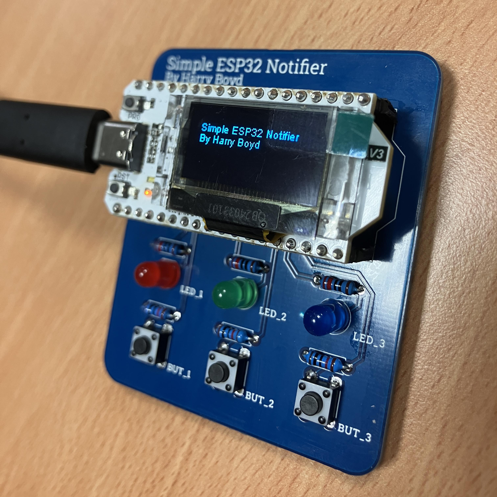

# Simple ESP32 Notifier

This is just a simple board to hold a
[Heltec WiFi Kit 32](https://heltec.org/project/wifi-kit32-v3/) ESP32 dev kit.

The board works for either the V2 or V3 boards, but require different pin
definitions due to the different pinouts of the boards. Pin definitions can be
found in [pinDefs_V2.h](reference/pinDefs_V2.h) and
[pinDefs_V3.h](reference/pinDefs_V3.h).

This Heltec board comes with a built in 0.96 OLED screen that is used for
showing notifications, and the board adds 3 LEDs and 3 Buttons.

As this board is designed to be simple it just uses through hole components and
uses one GPIO pin per LED and one per button.

# Photos

## Credit

For the ESP I am using a library by [bartloeff](https://github.com/bartloeff)
titled [heltec_htit-wb32](https://github.com/bartloeff/heltec_htit-wb32)

## Metric

The board is 7cm tall and 6cm wide, with 5mm radius corners.
